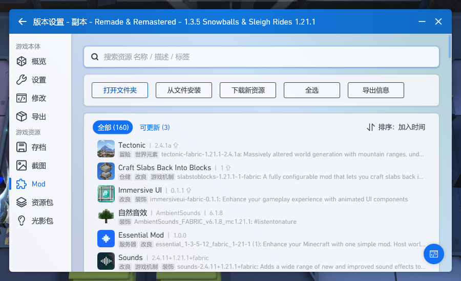

## Remade & Remastered: Snowflakes & Sleigh Rides
`Remade & Remastered: Snowflakes & Sleigh Rides` [[modrinth.com]](https://modrinth.com/modpack/remade-remastered/versions)
* `PCL2`  
`版本设置`  

    * 删除`immersiveui-fabric-0.1.1.jar`、`slabstoblocks-1.21.1-1-fabric.jar`、`tectonic-fabric-1.21.1-2.4.1a.jar`  
    `C:\Users\Administrator\AppData\Roaming\.minecraft\versions\Remade & Remastered - 1.3.5 Snowballs & Sleigh Rides 1.21.1\mods`
    
    * `更新`  
    
    * 还原`immersiveui-fabric-0.1.1.jar` `slabstoblocks-1.21.1-1-fabric.jar` `tectonic-fabric-1.21.1-2.4.1a.jar`
* `mods`  
`C:\Users\Administrator\AppData\Roaming\.minecraft\versions\Remade & Remastered - 1.3.5 Snowballs & Sleigh Rides 1.21.1\mods`
    * `FTB Library/FTB GUI Library` [[www.mcmod.cn]](https://www.mcmod.cn/class/3184.html) / [[www.curseforge.com]](https://www.curseforge.com/minecraft/mc-mods/ftb-library-fabric/files/all?version=1.21.1)
    * `连锁破坏` [[www.mcmod.cn]](https://www.mcmod.cn/class/3004.html) / [[www.curseforge.com]](https://www.curseforge.com/minecraft/mc-mods/ftb-ultimine-fabric/files/all?version=1.21.1)