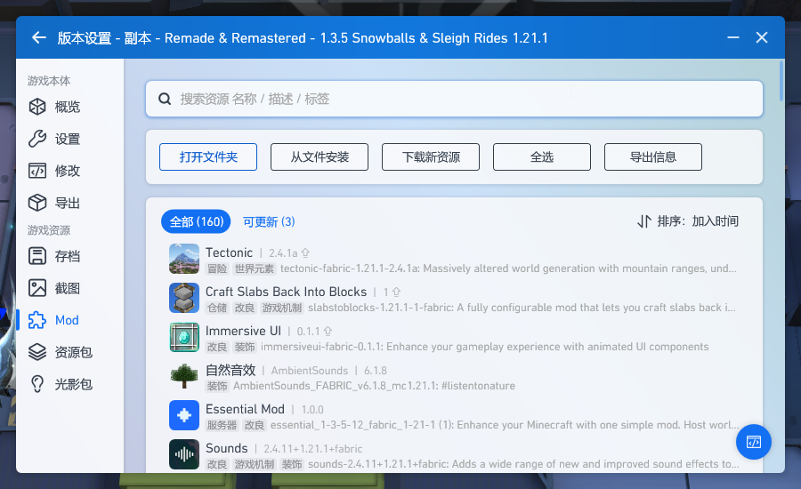

## Remade & Remastered: Snowflakes & Sleigh Rides
`Remade & Remastered: Snowflakes & Sleigh Rides` [[modrinth.com]](https://modrinth.com/modpack/remade-remastered/versions)  
`C:\Users\Administrator\AppData\Roaming\.minecraft\versions\Remade & Remastered - 1.3.5 Snowballs & Sleigh Rides 1.21.1`
* `PCL2`  
`版本设置`  

    * 删除`immersiveui-fabric-0.1.1.jar`、`slabstoblocks-1.21.1-1-fabric.jar`、`tectonic-fabric-1.21.1-2.4.1a.jar`  
    `C:\Users\Administrator\AppData\Roaming\.minecraft\versions\Remade & Remastered - 1.3.5 Snowballs & Sleigh Rides 1.21.1\mods`
    
    * `更新`  
    
    * 还原`immersiveui-fabric-0.1.1.jar` `slabstoblocks-1.21.1-1-fabric.jar` `tectonic-fabric-1.21.1-2.4.1a.jar`
* `mods`  
`C:\Users\Administrator\AppData\Roaming\.minecraft\versions\Remade & Remastered - 1.3.5 Snowballs & Sleigh Rides 1.21.1\mods`
    * `FTB Library/FTB GUI Library` [[www.mcmod.cn]](https://www.mcmod.cn/class/3184.html) / [[www.curseforge.com]](https://www.curseforge.com/minecraft/mc-mods/ftb-library-fabric/files/all?version=1.21.1)
    * `连锁破坏` [[www.mcmod.cn]](https://www.mcmod.cn/class/3004.html) / [[www.curseforge.com]](https://www.curseforge.com/minecraft/mc-mods/ftb-ultimine-fabric/files/all?version=1.21.1)
    * `万用皮肤补丁` [[www.mcmod.cn]](https://www.mcmod.cn/class/883.html) / [[modrinth.com]](https://modrinth.com/mod/customskinloader/versions?g=1.21.1&l=fabric)
    * `Xaero 的小地图` [[www.mcmod.cn]](https://www.mcmod.cn/class/1701.html) / [[modrinth.com]](https://modrinth.com/mod/xaeros-minimap/versions?g=1.21.1&l=fabric)
    * `Xaero 的世界地图` [[www.mcmod.cn]](https://www.mcmod.cn/class/1483.html) / [[modrinth.com]](https://modrinth.com/mod/xaeros-world-map/versions?g=1.21.1)
    * `一键背包整理 Next` [[www.mcmod.cn]](https://www.mcmod.cn/class/4104.html) / [[modrinth.com]](https://modrinth.com/mod/inventory-profiles-next)
* `ServerPackCreator` [[github.com]](https://github.com/Griefed/ServerPackCreator/releases)
    * 编辑 [server.properties](server.properties)  
    `C:\Users\Administrator\ServerPackCreator\server_files\server.properties`  
        * `Wiki` [[minecraft.fandom.com]](https://minecraft.fandom.com/zh/wiki/Server.properties)
            属性|描述
            -|-
            allow-flight|true
            difficulty|peaceful / hard
            gamemode|survival / creative / adventure / spectator
            online-mode|false / true
            spawn-protection|0 / 16
    * `Select files and/or directions to include in your server pack`
    
    
    * 删除`PCL`、`resourcepacks`、`shaderpacks`
    * `Minecraft Version` `1.21.1`
    * `Modloader Version` `0.16.14`
    * `Run Arguments`
        ```
        -Xmx6G -Xms6G
        ```

    
    * `Generate`
    * 编辑`variables.txt`
        ```
        SKIP_JAVA_CHECK=true
    * `Remade__Remastered_-_1.3.5_Snowballs__Sleigh_Rides_1.21.1.bat`  
    `C:\Users\Administrator\ServerPackCreator\server-packs\Remade__Remastered_-_1.3.5_Snowballs__Sleigh_Rides_1.21.1\start.bat`