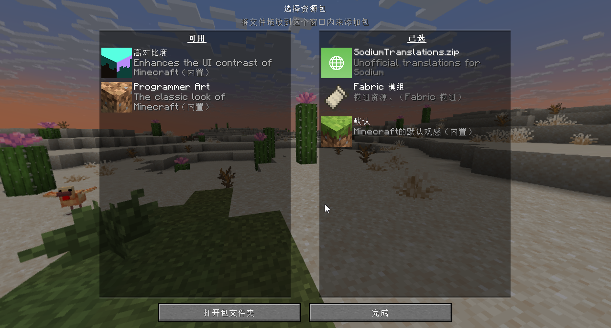
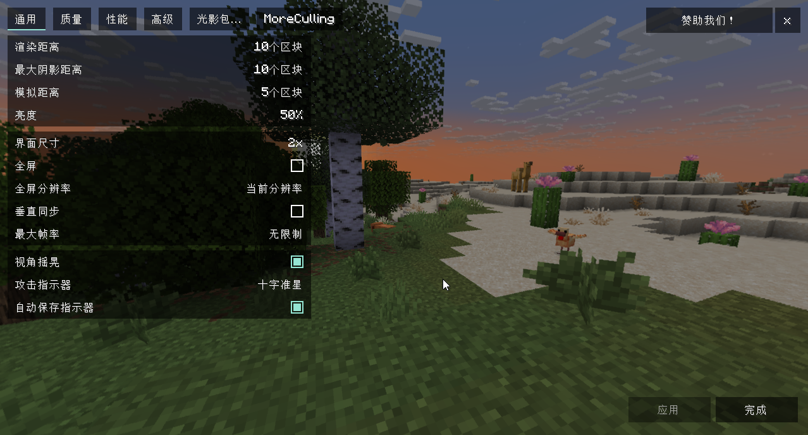
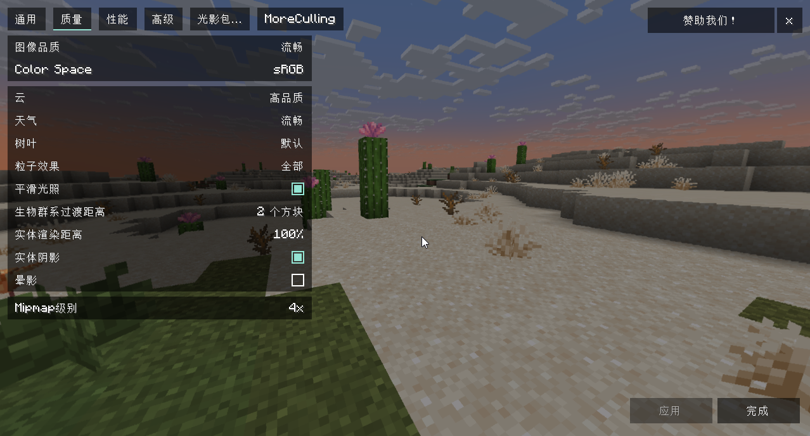
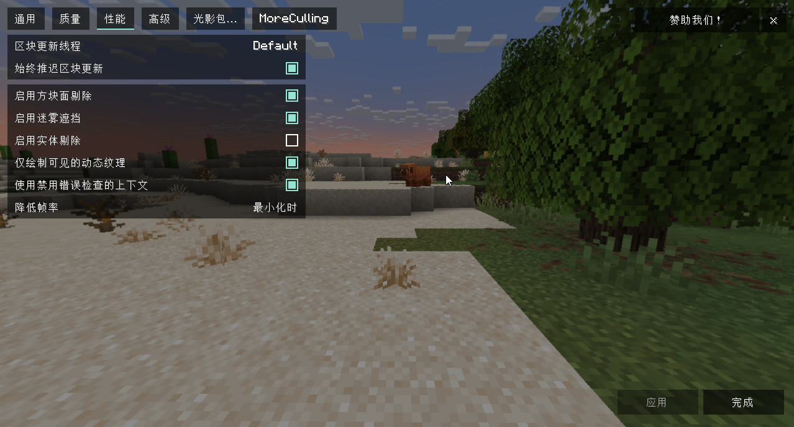
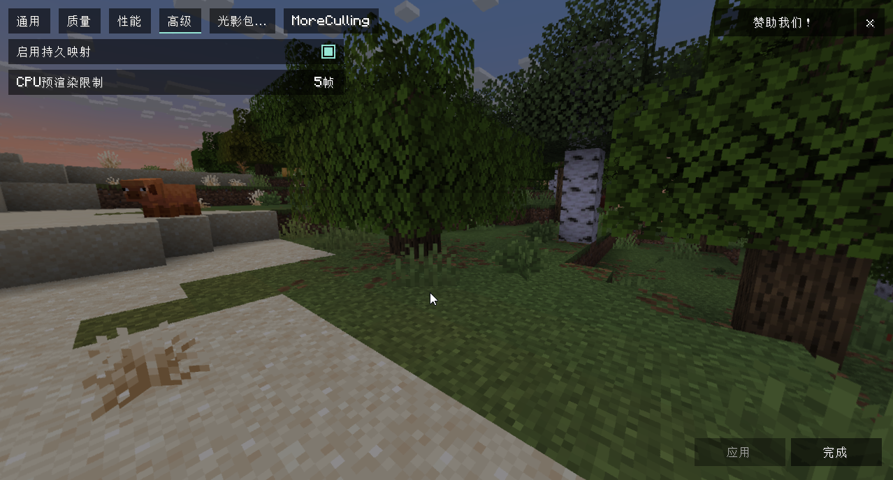

## 简单优化
`简单优化` [[www.mcmod.cn]](https://www.mcmod.cn/modpack/586.html) / [[modrinth.com]](https://modrinth.com/modpack/sop/versions)
* `PCL2`  
`版本设置`  
  

* `资源包`  
`Translations for Sodium` [[modrinth.com]](https://modrinth.com/resourcepack/translations-for-sodium/versions)  
`C:\Users\Administrator\AppData\Roaming\.minecraft\versions\Simply Optimized\resourcepacks`
* `mods`  
`Iris Shaders` [[www.mcmod.cn]](https://www.mcmod.cn/class/3697.html)
* `启动游戏`  
`选项`
    * `视场角` `90`
    * `自定义皮肤`  
    `主手` `左手`
    * `资源包`  
    
    * `视频设置`  
      
      
      
    