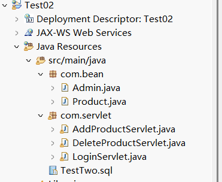
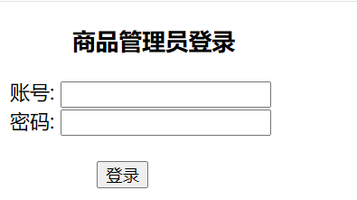
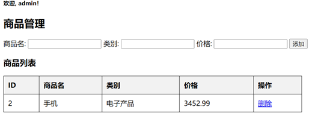
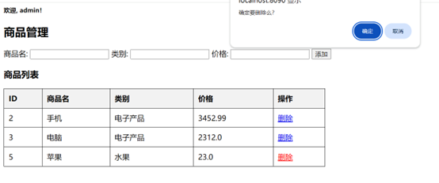
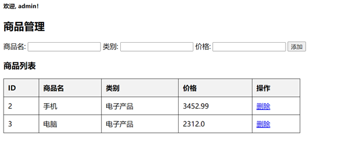

### 实践复习题二 商品信息管理
本项目是一个基于 Java Web 的商品管理系统，包含管理员登录、会话 Session 、添加商品、删除商品等功能。使用 JSP 、 Servlet 、 JDBC 进行开发，并连接 MySQL 数据库

开发环境：  
IDE ： Eclipse 或 MyEclipse  
JDK ： 8 及以上  
服务器： Apache Tomcat 8 以上  
数据库： MySQL 5.7 及以上  
依赖： JDBC 驱动 （ mysql-connector-j ）

0. PowerShell  
    **PS>**
    ```
    mysqld --install
    net stop mysql
    net start mysql
    mysql -u root -p
    ```
    ```
    ALTER USER 'root'@'localhost' IDENTIFIED BY '123456';
    exit
    ```
    **PS>**
    ```
    net stop mysql
    net start mysql
    mysql -u root -p
1. 数据库表结构。创建 productdb 数据库，并在数据库中创建 admin 与 products 表， SQL 语句如下  
    **mysqld>**
    ```
    CREATE DATABASE productdb DEFAULT CHARACTER SET utf8mb4 COLLATE utf8mb4_unicode_ci;

    USE productdb;

    CREATE TABLE admin (
    id INT AUTO_INCREMENT PRIMARY KEY,
    username VARCHAR(50) NOT NULL,
    password VARCHAR(50) NOT NULL
    );

    CREATE TABLE products (
    id INT AUTO_INCREMENT PRIMARY KEY,
    name VARCHAR(255) NOT NULL,
    category VARCHAR(255) NOT NULL,
    price DECIMAL(10,2) NOT NULL
    );

    INSERT INTO admin (username, password) VALUES ('admin', '123456');
    ```
2. 创建项目，项目名为 Test + 学号，学号为两位短学号，如： Test02
3. 在项目中创建一个 com.bean 的包，包下创建 Admin （管理员）、 Product （商品）两个类  
在项目中创建一个 com.servlet 的包，包下创建 LoginServlet 、 AddProductServlet 、 DeleteProductServlet 三个类  

4. Admin 类有三个私有属性 <font color=blue>id</font> 、 <font color=blue>username</font> 、 <font color=blue>password</font> ， Product 有 <font color=blue>id</font> 、 <font color=blue>name</font> 、 <font color=blue>category</font> 、 <font color=blue>price</font> 属性，创建构造初始化方法与 set 、 get 方法
    ```
    package com.bean;
    public class Admin {
        private int id;
        private String username;
        private String password;
        public Admin() {}
        public Admin(int id, String username, String password) {
            this.id = id;
            this.username = username;
            this.password = password;
        }
        public int getId() {
            return id;
        }
        public void setId(int id) {
            this.id = id;
        }
        public String getUsername() {
            return username;
        }
        public void setUsername(String username) {
            this.username = username;
        }
        public String getPassword() {
            return password;
        }
        public void setPassword(String password) {
            this.password = password;
        }
    }
    ```
    ```
    package com.bean;
    public class Product {
        private int id;
        private String name;
        private String category;
        private double price;
        public Product() {}
        public Product(int id, String name, String category, double price) {
            this.id = id;
            this.name = name;
            this.category = category;
            this.price = price;
        }
        public int getId() {
            return id;
        }
        public void setId(int id) {
            this.id = id;
        }
        public String getName() {
            return name;
        }
        public void setName(String name) {
            this.name = name;
        }
        public String getCategory() {
            return category;
        }
        public void setCategory(String category) {
            this.category = category;
        }
        public double getPrice() {
            return price;
        }
        public void setPrice(double price) {
            this.price = price;
        }
        @Override
        public String toString() {
            return "Product{id=" + id + ", name='" + name + "', category='" + category + "', price=" + price + "}";
        }
    }
    ```
    后端代码  
    后端登录业务代码
    ```
    package com.servlet;
    import java.io.IOException;
    import java.sql.Connection;
    import java.sql.DriverManager;
    import java.sql.PreparedStatement;
    import java.sql.ResultSet;
    import javax.servlet.ServletException;
    import javax.servlet.annotation.WebServlet;
    import javax.servlet.http.HttpServlet;
    import javax.servlet.http.HttpServletRequest;
    import javax.servlet.http.HttpServletResponse;
    import javax.servlet.http.HttpSession;
    import com.bean.Admin;
    @WebServlet("/LoginServlet")
    public class LoginServlet extends HttpServlet {
        protected void doPost(HttpServletRequest request, HttpServletResponse response) throws ServletException, IOException {
            request.setCharacterEncoding("UTF-8");
            response.setCharacterEncoding("UTF-8");
            String username = request.getParameter("username");
            String password = request.getParameter("password");
            try {
                Class.forName("com.mysql.cj.jdbc.Driver");
                Connection conn = DriverManager.getConnection("jdbc:mysql://localhost:3306/productdb?useUnicode=true&characterEncoding=UTF-8", "root", "123456");
                PreparedStatement ps = conn.prepareStatement("SELECT * FROM admin WHERE username=? AND password=?");
                ps.setString(1, username);
                ps.setString(2, password);
                ResultSet rs = ps.executeQuery();
                if (rs.next()) {
                    Admin admin = new Admin(rs.getInt("id"), rs.getString("username"), rs.getString("password"));
                    HttpSession session = request.getSession();
                    session.setAttribute("admin", username);
                    response.sendRedirect("productList.jsp");
                } else {
                    response.getWriter().println("<script>alert('无效的用户名与密码'); window.location='login.jsp';</script>");
                }
            } catch (Exception e) {
                e.printStackTrace();
            }
        }
    }
    ```
    商品添加的业务处理
    ```
    package com.servlet;
    import java.io.IOException;
    import java.sql.*;
    import javax.servlet.ServletException;
    import javax.servlet.annotation.WebServlet;
    import javax.servlet.http.HttpServlet;
    import javax.servlet.http.HttpServletRequest;
    import javax.servlet.http.HttpServletResponse;
    import com.bean.Product;
    @WebServlet("/AddProductServlet")
    public class AddProductServlet extends HttpServlet {
        protected void doPost(HttpServletRequest request, HttpServletResponse response)
                throws ServletException, IOException {
            request.setCharacterEncoding("UTF-8");
            response.setCharacterEncoding("UTF-8");
            String name = request.getParameter("name");
            String category = request.getParameter("category");
            double price = Double.parseDouble(request.getParameter("price"));
            Product product = new Product(0, name, category, price);
            try {
                Class.forName("com.mysql.cj.jdbc.Driver");
                Connection conn = DriverManager.getConnection(
                        "jdbc:mysql://localhost:3306/productdb?useUnicode=true&characterEncoding=UTF-8",
                        "root", "123456");
                String sql = "INSERT INTO products (name, category, price) VALUES (?, ?, ?)";
                PreparedStatement ps = conn.prepareStatement(sql);
                ps.setString(1, product.getName());
                ps.setString(2, product.getCategory());
                ps.setDouble(3, product.getPrice());
                ps.executeUpdate();
                conn.close();
            } catch (Exception e) {
                e.printStackTrace();
            }
            response.sendRedirect("productList.jsp");
        }
    }
    ```
    删除的后端实现代码
    ```
    package com.servlet;
    import java.io.IOException;
    import java.sql.*;
    import javax.servlet.ServletException;
    import javax.servlet.annotation.WebServlet;
    import javax.servlet.http.HttpServlet;
    import javax.servlet.http.HttpServletRequest;
    import javax.servlet.http.HttpServletResponse;
    import com.bean.Product;
    @WebServlet("/DeleteProductServlet")
    public class DeleteProductServlet extends HttpServlet {
        protected void doGet(HttpServletRequest request, HttpServletResponse response)
                throws ServletException, IOException {
            request.setCharacterEncoding("UTF-8");
            response.setCharacterEncoding("UTF-8");
            int id = Integer.parseInt(request.getParameter("id"));
            Product product = new Product(id, null, null, 0);
            try {
                Class.forName("com.mysql.cj.jdbc.Driver");
                Connection conn = DriverManager.getConnection(
                        "jdbc:mysql://localhost:3306/productdb?useUnicode=true&characterEncoding=UTF-8",
                        "root", "123456");
                String sql = "DELETE FROM products WHERE id=?";
                PreparedStatement ps = conn.prepareStatement(sql);
                ps.setInt(1, product.getId());
                ps.executeUpdate();
                conn.close();
            } catch (Exception e) {
                e.printStackTrace();
            }
            response.sendRedirect("productList.jsp");
        }
    }
    ```
5. 将数据库连接驱动复制粘贴到项目中  
  
将 mysql-connector-j.jar 加入 WEB-INF/bli ，然后右击 Build Path ，选择 Add to Build Path 即可
6. 在 webapp 下（软件版本不同，有的在 WebContent ），创建登录界面，命名为 login.jsp ，如下图所示，实现管理员的登录功能  
在 webapp 下（软件版本不同，有的在 WebContent ），创建商品管理页面，命名为 productList.jsp ，如下图所示，实现管理员的管理功能  
  
登录页面代码  
    ```
    <%@ page contentType="text/html;charset=UTF-8" language="java" %>
    <!DOCTYPE html>
    <html>
    <head>
        <title>Admin Login</title>
    </head>
    <body>
        <h3 style="margin-left:50px">商品管理员登录</h2>
        <form action="LoginServlet" method="post">
            <label>账号:</label>
            <input type="text" name="username" required><br>
            <label>密码:</label>
            <input type="password" name="password" required><br>
            <input type="submit" style="margin-left:70px;margin-top:20px" value="登录">
        </form>
    </body>
    </html>
    ```
    商品管理页面
    ```
    <%@ page language="java" contentType="text/html; charset=UTF-8" pageEncoding="UTF-8"%>
    <%@ page import="java.sql.*, java.util.*, com.bean.Product" %>
    <%
        String username = (String) session.getAttribute("admin");
        if (username == null) {
            response.sendRedirect("login.jsp");
            return;
        }
    %>
    <html>
    <head>
        <title>商品管理</title>
    </head>
    <style>
            form { margin-bottom: 20px; }
            table { width: 50%; border-collapse: collapse; }
            th, td { border: 1px solid black; padding: 10px; text-align: left; }
            th { background-color: #f2f2f2; }
        </style>
    <body>
    <h5>欢迎, <%= username %>！</h2>
        <h2>商品管理</h2>
        <form action="AddProductServlet" method="post">
            商品名: <input type="text" name="name" required>
            类别: <input type="text" name="category" required>
            价格: <input type="text" name="price" required>
            <input type="submit" value="添加">
        </form>
        <h3>商品列表</h3>
        <table border="1">
            <tr>
                <th>ID</th><th>商品名</th><th>类别</th><th>价格</th><th>操作</th>
            </tr>
            <%
                List<Product> productList = new ArrayList<>();
                try {
                    Class.forName("com.mysql.cj.jdbc.Driver");
                    Connection conn = DriverManager.getConnection(
                        "jdbc:mysql://localhost:3306/productdb?useUnicode=true&characterEncoding=UTF-8",
                        "root", "123456");
                    Statement stmt = conn.createStatement();
                    ResultSet rs = stmt.executeQuery("SELECT * FROM products");
                    while(rs.next()) {
                        Product product = new Product(
                            rs.getInt("id"),
                            rs.getString("name"),
                            rs.getString("category"),
                            rs.getDouble("price"));
                        productList.add(product);
                    }
                    conn.close();
                } catch (Exception e) {
                    e.printStackTrace();
                }
                for(Product p : productList) {
            %>
            <tr>
                <td><%= p.getId() %></td>
                <td><%= p.getName() %></td>
                <td><%= p.getCategory() %></td>
                <td><%= p.getPrice() %></td>
                <td><a href="DeleteProductServlet?id=<%= p.getId() %>">删除</a></td>
            </tr>
            <% } %>
        </table>
    </body>
    </html>
    ```
7. 登录成功后跳转到商品管理页面，在界面表单中添加信息，点击按钮后，页面的列表中会显示添加的商品信息，同时通过 Session 功能显示欢迎登录用户名信息  

8. 点击表格中的删除按钮，弹出确定删除的弹框，点击确定即将该商品信息删除，删除成功后，页面重新刷新，显示新的商品列表信息  
  
删除成功后的界面  

9. 启动项目
    1. 在 MySQL 中执行 SQL 语句，创建数据库和表
    2. 在 Eclipse 中导入项目，确保 Tomcat 服务器已添加
    3. 将 mysql-connector-j.jar 添加到 lib 目录
    4. 启动 Tomcat 服务器，访问 http://localhost:8080/Test02/login.jsp 进行登录
    5. 登录后可进行书籍的添加、修改和删除。注意 Tomcat 的端口号是否是 8080 ，根据环境自行修改