### 实践复习题一 图书信息管理
本项目是一个基于 Java Web 的图书管理系统，包含管理员登录、添加图书、删除图书等功能。使用 JSP 、 Servlet 、 JDBC 进行开发，并连接 MySQL 数据库

开发环境：  
IDE ： Eclipse 或 MyEclipse  
JDK ： 8 及以上  
服务器： Apache Tomcat 8 以上  
数据库： MySQL 5.7 及以上  
依赖： JDBC 驱动 （ mysql-connector-j ）

0. PowerShell  
    **PS>**
    ```
    mysqld --install
    net stop mysql
    net start mysql
    mysql -u root -p
    ```
    **mysql>**
    ```
    ALTER USER 'root'@'localhost' IDENTIFIED BY '123456';
    exit;
    ```
    **PS>**
    ```
    net stop mysql
    net start mysql
    mysql -u root -p
1. 数据库表结构。创建 bookdb 数据库，并在数据库中创建 admin 与 books 表， SQL 语句如下  
注意预先设置好一个登录账号与密码  
**mysql>**
    ```
    CREATE DATABASE bookdb;
    USE bookdb;
    CREATE TABLE admin (
    id INT AUTO_INCREMENT PRIMARY KEY,
    username VARCHAR(50) NOT NULL,
    password VARCHAR(50) NOT NULL
    );
    INSERT INTO admin (username, password) VALUES ('admin', '123456');
    CREATE TABLE books (
    id INT AUTO_INCREMENT PRIMARY KEY,
    title VARCHAR(100) NOT NULL,
    author VARCHAR(100) NOT NULL,
    price DECIMAL(10,2) NOT NULL
    );
    ```
2. 创建项目，项目名为 Test + 学号，学号为两位短学号，如： Test01
3. 在项目中创建一个 com.bean 的包，包下创建 Admin （管理员）、 Book （图书）两个类  
在项目中创建一个 com.test 的包，包下创建 LoginServlet 、 AddBookServlet 、 DeleteBookServlet 三个类  
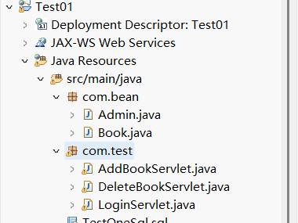
4. Admin 类有三个私有属性 id 、 username 、 password ， Book 有 id 、 title 、 author 、 price 属性，创建构造初始化方法与 set 、 get 方法
    ```
    package com.bean;
    public class Admin {
        private int id;
        private String username;
        private String password;
        public Admin() {}
        public Admin(int id, String username, String password) {
            this.id = id;
            this.username = username;
            this.password = password;
        }
        public int getId() {
            return id;
        }
        public void setId(int id) {
            this.id = id;
        }
        public String getUsername() {
            return username;
        }
        public void setUsername(String username) {
            this.username = username;
        }
        public String getPassword() {
            return password;
        }
        public void setPassword(String password) {
            this.password = password;
        }
    }
    ```
    ```
    package com.bean;
    public class Book {
        private int id;
        private String title;
        private String author;
        private double price;
        public Book() {}
        public Book(int id, String title, String author, double price) {
            this.id = id;
            this.title = title;
            this.author = author;
            this.price = price;
        }
        public int getId() {
            return id;
        }
        public void setId(int id) {
            this.id = id;
        }
        public String getTitle() {
            return title;
        }
        public void setTitle(String title) {
            this.title = title;
        }
        public String getAuthor() {
            return author;
        }
        public void setAuthor(String author) {
            this.author = author;
        }
        public double getPrice() {
            return price;
        }
        public void setPrice(double price) {
            this.price = price;
        }
    }
    ```
    后端接收登录信息代码
    ```
    package com.test;
    import java.io.IOException;
    import java.sql.Connection;
    import java.sql.DriverManager;
    import java.sql.PreparedStatement;
    import java.sql.ResultSet;
    import javax.servlet.ServletException;
    import javax.servlet.annotation.WebServlet;
    import javax.servlet.http.HttpServlet;
    import javax.servlet.http.HttpServletRequest;
    import javax.servlet.http.HttpServletResponse;
    import javax.servlet.http.HttpSession;
    import com.bean.Admin;
    @WebServlet("/LoginServlet")
    public class LoginServlet extends HttpServlet {
        protected void doPost(HttpServletRequest request, HttpServletResponse response) throws ServletException, IOException {
            String username = request.getParameter("username");
            String password = request.getParameter("password");
            try {
                Class.forName("com.mysql.cj.jdbc.Driver");
                Connection conn = DriverManager.getConnection("jdbc:mysql://localhost:3306/bookdb", "root", "123456");
                PreparedStatement ps = conn.prepareStatement("SELECT * FROM admin WHERE username=? AND password=?");
                ps.setString(1, username);
                ps.setString(2, password);
                ResultSet rs = ps.executeQuery();
                if (rs.next()) {
                    Admin admin = new Admin(rs.getInt("id"), rs.getString("username"), rs.getString("password"));
                    HttpSession session = request.getSession();
                    session.setAttribute("admin", admin);
                    response.sendRedirect("bookList.jsp");
                } else {
                    response.getWriter().println("<script>alert('Invalid username or password'); window.location='index.jsp';</script>");
                }
            } catch (Exception e) {
                e.printStackTrace();
            }
        }
    }
    ```
    后端代码  
    图书添加的业务处理
    ```
    package com.test;
    import java.io.IOException;
    import java.sql.Connection;
    import java.sql.DriverManager;
    import java.sql.PreparedStatement;
    import javax.servlet.ServletException;
    import javax.servlet.annotation.WebServlet;
    import javax.servlet.http.HttpServlet;
    import javax.servlet.http.HttpServletRequest;
    import javax.servlet.http.HttpServletResponse;
    import com.bean.Book;
    @WebServlet("/AddBookServlet")
    public class AddBookServlet extends HttpServlet {
        protected void doPost(HttpServletRequest request, HttpServletResponse response) throws ServletException, IOException {
            request.setCharacterEncoding("UTF-8");
            response.setCharacterEncoding("UTF-8");
            String title = request.getParameter("title");
            String author = request.getParameter("author");
            double price = Double.parseDouble(request.getParameter("price"));
            Book book = new Book(0, title, author, price);
            try {
                Class.forName("com.mysql.cj.jdbc.Driver");
                Connection conn = DriverManager.getConnection("jdbc:mysql://localhost:3306/bookdb?useUnicode=true&characterEncoding=UTF-8", "root", "123456");
                PreparedStatement ps = conn.prepareStatement("INSERT INTO books (title, author, price) VALUES (?, ?, ?)");
                ps.setString(1, book.getTitle());
                ps.setString(2, book.getAuthor());
                ps.setDouble(3, book.getPrice());
                ps.executeUpdate();
                response.sendRedirect("bookList.jsp");
            } catch (Exception e) {
                e.printStackTrace();
            }
        }
    }
    ```
    删除的后端实现代码
    ```
    package com.test;
    import java.io.IOException;
    import java.sql.Connection;
    import java.sql.DriverManager;
    import java.sql.PreparedStatement;
    import java.sql.SQLException;
    import javax.servlet.ServletException;
    import javax.servlet.annotation.WebServlet;
    import javax.servlet.http.HttpServlet;
    import javax.servlet.http.HttpServletRequest;
    import javax.servlet.http.HttpServletResponse;
    @WebServlet("/DeleteBookServlet")
    public class DeleteBookServlet extends HttpServlet {
        protected void doGet(HttpServletRequest request, HttpServletResponse response) throws ServletException, IOException {
            int id = Integer.parseInt(request.getParameter("id"));
            try {
                Class.forName("com.mysql.cj.jdbc.Driver");
                Connection conn = DriverManager.getConnection("jdbc:mysql://localhost:3306/bookdb?useUnicode=true&characterEncoding=UTF-8", "root", "123456");
                PreparedStatement ps = conn.prepareStatement("DELETE FROM books WHERE id=?");
                ps.setInt(1, id);
                ps.executeUpdate();
                response.sendRedirect("bookList.jsp");
            } catch (SQLException | ClassNotFoundException e) {
                e.printStackTrace();
            }
        }
    }
    ```
5. 将数据库连接驱动复制粘贴到项目中  
  
将 mysql-connector-j.jar 加入 WEB-INF/lib ，然后右击 Build Path ，选择 Add to Build Path 即可
6. 在 webapp 下（软件版本不同，有的在 WebContent ），创建登录界面，命名为 login.jsp ，如下图所示，实现管理员的登录功能  
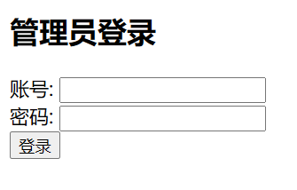  
登录页面代码
    ```
    <%@ page contentType="text/html;charset=UTF-8" language="java" %>
    <!DOCTYPE html>
    <html>
    <head>
        <title>Admin Login</title>
    </head>
    <body>
        <h2>管理员登录</h2>
        <form action="LoginServlet" method="post">
            <label>账号:</label>
            <input type="text" name="username" required><br>
            <label>密码:</label>
            <input type="password" name="password" required><br>
            <input type="submit" value="登录">
        </form>
    </body>
    </html>
    ```
    书籍管理页面（ bookList.jsp ）
    ```
    <%@ page import="java.sql.*" %>
    <%@ page import="java.io.*" %>
    <%@ page contentType="text/html;charset=UTF-8" language="java" %>
    <!DOCTYPE html>
    <html>
    <head>
        <title>图书界面</title>
    </head>
        <style>
            form { margin-bottom: 20px; }
            table { width: 50%; border-collapse: collapse; }
            th, td { border: 1px solid black; padding: 10px; text-align: left; }
            th { background-color: #f2f2f2; }
        </style>
    <body>
        <h2>添加图书信息</h2>
        <form action="AddBookServlet" method="post">
            <label>书名:</label>
            <input type="text" name="title" required><br>
            <label>作者:</label>
            <input type="text" name="author" required><br>
            <label>价格:</label>
            <input type="text" name="price" required><br>
            <input type="submit" value="添加">
        </form>
        <h2>图书列表信息</h2>
        <table border="1">
            <tr>
                <th>ID</th>
                <th>书名</th>
                <th>作者</th>
                <th>价格</th>
                <th>操作</th>
            </tr>
            <%
                Class.forName("com.mysql.cj.jdbc.Driver");
                Connection conn = DriverManager.getConnection("jdbc:mysql://localhost:3306/bookdb", "root", "123456");
                PreparedStatement ps = conn.prepareStatement("SELECT * FROM books");
                ResultSet rs = ps.executeQuery();
                while (rs.next()) {
            %>
            <tr>
                <td><%= rs.getInt("id") %></td>
                <td><%= rs.getString("title") %></td>
                <td><%= rs.getString("author") %></td>
                <td><%= rs.getBigDecimal("price") %></td>
                <td>
                    <a href="editBook.jsp?id=<%= rs.getInt("id") %>">编辑</a>
                    <a href="DeleteBookServlet?id=<%= rs.getInt("id") %>" onclick="return confirm('确定要删除么?');">删除</a>
                </td>
            </tr>
            <%
                }
                rs.close();
                ps.close();
                conn.close();
            %>
        </table>
    </body>
    </html>
    ```
7. 登录成功后跳转到书籍管理页面，在界面表单中添加信息，点击按钮后，页面的列表中会显示添加的图书信息  
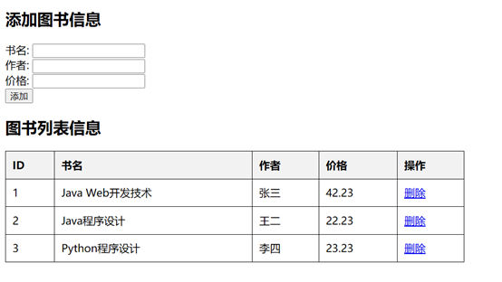
8. 点击表格中的删除按钮，弹出确定删除的弹框，点击确定即将该图书信息删除，删除成功后，页面重新刷新，显示新的图书列表信息  
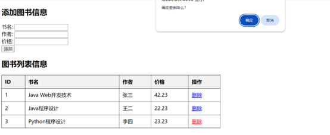  
删除成功后的界面  
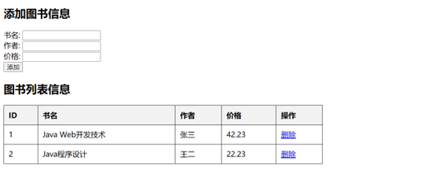
9. 启动项目
    1. 在 MySQL 中执行 SQL 语句，创建数据库和表
    2. 在 Eclipse 中导入项目，确保 Tomcat 服务器已添加
    3. 将 mysql-connector-j.jar 添加到 lib 目录
    4. 启动 Tomcat 服务器，访问 http://localhost:8080/Test01/login.jsp 进行登录
    5. 登录后可进行书籍的添加、修改和删除。注意 Tomcat 的端口号是否是 8080 ，根据环境自行修改
### 实践复习题二 商品信息管理
本项目是一个基于 Java Web 的商品管理系统，包含管理员登录、会话 Session 、添加商品、删除商品等功能。使用 JSP 、 Servlet 、 JDBC 进行开发，并连接 MySQL 数据库

开发环境：  
IDE ： Eclipse 或 MyEclipse  
JDK ： 8 及以上  
服务器： Apache Tomcat 8 以上  
数据库： MySQL 5.7 及以上  
依赖： JDBC 驱动 （ mysql-connector-j ）

0. PowerShell  
**PS>**
    ```
    mysqld --install
    net stop mysql
    net start mysql
    mysql -u root -p
    ```
    **mysql>**
    ```
    ALTER USER 'root'@'localhost' IDENTIFIED BY '123456';
    exit;
    ```
    **PS>**
    ```
    net stop mysql
    net start mysql
    mysql -u root -p
1. 数据库表结构。创建 productdb 数据库，并在数据库中创建 admin 与 products 表， SQL 语句如下  
**mysql>**
    ```
    CREATE DATABASE productdb DEFAULT CHARACTER SET utf8mb4 COLLATE utf8mb4_unicode_ci;
    USE productdb;
    CREATE TABLE admin (
    id INT AUTO_INCREMENT PRIMARY KEY,
    username VARCHAR(50) NOT NULL,
    password VARCHAR(50) NOT NULL
    );
    CREATE TABLE products (
    id INT AUTO_INCREMENT PRIMARY KEY,
    name VARCHAR(255) NOT NULL,
    category VARCHAR(255) NOT NULL,
    price DECIMAL(10,2) NOT NULL
    );
    INSERT INTO admin (username, password) VALUES ('admin', '123456');
    ```
2. 创建项目，项目名为 Test + 学号，学号为两位短学号，如： Test02
3. 在项目中创建一个 com.bean 的包，包下创建 Admin （管理员）、 Product （商品）两个类  
在项目中创建一个 com.servlet 的包，包下创建 LoginServlet 、 AddProductServlet 、 DeleteProductServlet 三个类  
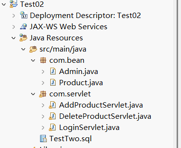
4. Admin 类有三个私有属性 <font color=blue>id</font> 、 <font color=blue>username</font> 、 <font color=blue>password</font> ， Product 有 <font color=blue>id</font> 、 <font color=blue>name</font> 、 <font color=blue>category</font> 、 <font color=blue>price</font> 属性，创建构造初始化方法与 set 、 get 方法
    ```
    package com.bean;
    public class Admin {
        private int id;
        private String username;
        private String password;
        public Admin() {}
        public Admin(int id, String username, String password) {
            this.id = id;
            this.username = username;
            this.password = password;
        }
        public int getId() {
            return id;
        }
        public void setId(int id) {
            this.id = id;
        }
        public String getUsername() {
            return username;
        }
        public void setUsername(String username) {
            this.username = username;
        }
        public String getPassword() {
            return password;
        }
        public void setPassword(String password) {
            this.password = password;
        }
    }
    ```
    ```
    package com.bean;
    public class Product {
        private int id;
        private String name;
        private String category;
        private double price;
        public Product() {}
        public Product(int id, String name, String category, double price) {
            this.id = id;
            this.name = name;
            this.category = category;
            this.price = price;
        }
        public int getId() {
            return id;
        }
        public void setId(int id) {
            this.id = id;
        }
        public String getName() {
            return name;
        }
        public void setName(String name) {
            this.name = name;
        }
        public String getCategory() {
            return category;
        }
        public void setCategory(String category) {
            this.category = category;
        }
        public double getPrice() {
            return price;
        }
        public void setPrice(double price) {
            this.price = price;
        }
        @Override
        public String toString() {
            return "Product{id=" + id + ", name='" + name + "', category='" + category + "', price=" + price + "}";
        }
    }
    ```
    后端代码  
    后端登录业务代码
    ```
    package com.servlet;
    import java.io.IOException;
    import java.sql.Connection;
    import java.sql.DriverManager;
    import java.sql.PreparedStatement;
    import java.sql.ResultSet;
    import javax.servlet.ServletException;
    import javax.servlet.annotation.WebServlet;
    import javax.servlet.http.HttpServlet;
    import javax.servlet.http.HttpServletRequest;
    import javax.servlet.http.HttpServletResponse;
    import javax.servlet.http.HttpSession;
    import com.bean.Admin;
    @WebServlet("/LoginServlet")
    public class LoginServlet extends HttpServlet {
        protected void doPost(HttpServletRequest request, HttpServletResponse response) throws ServletException, IOException {
            request.setCharacterEncoding("UTF-8");
            response.setCharacterEncoding("UTF-8");
            String username = request.getParameter("username");
            String password = request.getParameter("password");
            try {
                Class.forName("com.mysql.cj.jdbc.Driver");
                Connection conn = DriverManager.getConnection("jdbc:mysql://localhost:3306/productdb?useUnicode=true&characterEncoding=UTF-8", "root", "123456");
                PreparedStatement ps = conn.prepareStatement("SELECT * FROM admin WHERE username=? AND password=?");
                ps.setString(1, username);
                ps.setString(2, password);
                ResultSet rs = ps.executeQuery();
                if (rs.next()) {
                    Admin admin = new Admin(rs.getInt("id"), rs.getString("username"), rs.getString("password"));
                    HttpSession session = request.getSession();
                    session.setAttribute("admin", username);
                    response.sendRedirect("productList.jsp");
                } else {
                    response.getWriter().println("<script>alert('无效的用户名与密码'); window.location='login.jsp';</script>");
                }
            } catch (Exception e) {
                e.printStackTrace();
            }
        }
    }
    ```
    商品添加的业务处理
    ```
    package com.servlet;
    import java.io.IOException;
    import java.sql.*;
    import javax.servlet.ServletException;
    import javax.servlet.annotation.WebServlet;
    import javax.servlet.http.HttpServlet;
    import javax.servlet.http.HttpServletRequest;
    import javax.servlet.http.HttpServletResponse;
    import com.bean.Product;
    @WebServlet("/AddProductServlet")
    public class AddProductServlet extends HttpServlet {
        protected void doPost(HttpServletRequest request, HttpServletResponse response)
                throws ServletException, IOException {
            request.setCharacterEncoding("UTF-8");
            response.setCharacterEncoding("UTF-8");
            String name = request.getParameter("name");
            String category = request.getParameter("category");
            double price = Double.parseDouble(request.getParameter("price"));
            Product product = new Product(0, name, category, price);
            try {
                Class.forName("com.mysql.cj.jdbc.Driver");
                Connection conn = DriverManager.getConnection(
                        "jdbc:mysql://localhost:3306/productdb?useUnicode=true&characterEncoding=UTF-8",
                        "root", "123456");
                String sql = "INSERT INTO products (name, category, price) VALUES (?, ?, ?)";
                PreparedStatement ps = conn.prepareStatement(sql);
                ps.setString(1, product.getName());
                ps.setString(2, product.getCategory());
                ps.setDouble(3, product.getPrice());
                ps.executeUpdate();
                conn.close();
            } catch (Exception e) {
                e.printStackTrace();
            }
            response.sendRedirect("productList.jsp");
        }
    }
    ```
    删除的后端实现代码
    ```
    package com.servlet;
    import java.io.IOException;
    import java.sql.*;
    import javax.servlet.ServletException;
    import javax.servlet.annotation.WebServlet;
    import javax.servlet.http.HttpServlet;
    import javax.servlet.http.HttpServletRequest;
    import javax.servlet.http.HttpServletResponse;
    import com.bean.Product;
    @WebServlet("/DeleteProductServlet")
    public class DeleteProductServlet extends HttpServlet {
        protected void doGet(HttpServletRequest request, HttpServletResponse response)
                throws ServletException, IOException {
            request.setCharacterEncoding("UTF-8");
            response.setCharacterEncoding("UTF-8");
            int id = Integer.parseInt(request.getParameter("id"));
            Product product = new Product(id, null, null, 0);
            try {
                Class.forName("com.mysql.cj.jdbc.Driver");
                Connection conn = DriverManager.getConnection(
                        "jdbc:mysql://localhost:3306/productdb?useUnicode=true&characterEncoding=UTF-8",
                        "root", "123456");
                String sql = "DELETE FROM products WHERE id=?";
                PreparedStatement ps = conn.prepareStatement(sql);
                ps.setInt(1, product.getId());
                ps.executeUpdate();
                conn.close();
            } catch (Exception e) {
                e.printStackTrace();
            }
            response.sendRedirect("productList.jsp");
        }
    }
    ```
5. 将数据库连接驱动复制粘贴到项目中  
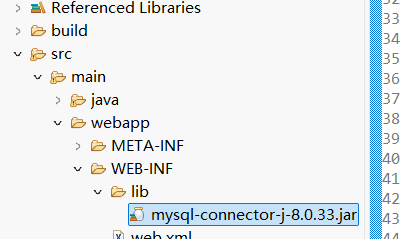  
将 mysql-connector-j.jar 加入 WEB-INF/bli ，然后右击 Build Path ，选择 Add to Build Path 即可
6. 在 webapp 下（软件版本不同，有的在 WebContent ），创建登录界面，命名为 login.jsp ，如下图所示，实现管理员的登录功能  
在 webapp 下（软件版本不同，有的在 WebContent ），创建商品管理页面，命名为 productList.jsp ，如下图所示，实现管理员的管理功能  
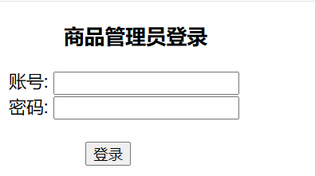  
登录页面代码  
    ```
    <%@ page contentType="text/html;charset=UTF-8" language="java" %>
    <!DOCTYPE html>
    <html>
    <head>
        <title>Admin Login</title>
    </head>
    <body>
        <h3 style="margin-left:50px">商品管理员登录</h2>
        <form action="LoginServlet" method="post">
            <label>账号:</label>
            <input type="text" name="username" required><br>
            <label>密码:</label>
            <input type="password" name="password" required><br>
            <input type="submit" style="margin-left:70px;margin-top:20px" value="登录">
        </form>
    </body>
    </html>
    ```
    商品管理页面
    ```
    <%@ page language="java" contentType="text/html; charset=UTF-8" pageEncoding="UTF-8"%>
    <%@ page import="java.sql.*, java.util.*, com.bean.Product" %>
    <%
        String username = (String) session.getAttribute("admin");
        if (username == null) {
            response.sendRedirect("login.jsp");
            return;
        }
    %>
    <html>
    <head>
        <title>商品管理</title>
    </head>
    <style>
            form { margin-bottom: 20px; }
            table { width: 50%; border-collapse: collapse; }
            th, td { border: 1px solid black; padding: 10px; text-align: left; }
            th { background-color: #f2f2f2; }
        </style>
    <body>
    <h5>欢迎, <%= username %>！</h2>
        <h2>商品管理</h2>
        <form action="AddProductServlet" method="post">
            商品名: <input type="text" name="name" required>
            类别: <input type="text" name="category" required>
            价格: <input type="text" name="price" required>
            <input type="submit" value="添加">
        </form>
        <h3>商品列表</h3>
        <table border="1">
            <tr>
                <th>ID</th><th>商品名</th><th>类别</th><th>价格</th><th>操作</th>
            </tr>
            <%
                List<Product> productList = new ArrayList<>();
                try {
                    Class.forName("com.mysql.cj.jdbc.Driver");
                    Connection conn = DriverManager.getConnection(
                        "jdbc:mysql://localhost:3306/productdb?useUnicode=true&characterEncoding=UTF-8",
                        "root", "123456");
                    Statement stmt = conn.createStatement();
                    ResultSet rs = stmt.executeQuery("SELECT * FROM products");
                    while(rs.next()) {
                        Product product = new Product(
                            rs.getInt("id"),
                            rs.getString("name"),
                            rs.getString("category"),
                            rs.getDouble("price"));
                        productList.add(product);
                    }
                    conn.close();
                } catch (Exception e) {
                    e.printStackTrace();
                }
                for(Product p : productList) {
            %>
            <tr>
                <td><%= p.getId() %></td>
                <td><%= p.getName() %></td>
                <td><%= p.getCategory() %></td>
                <td><%= p.getPrice() %></td>
                <td><a href="DeleteProductServlet?id=<%= p.getId() %>">删除</a></td>
            </tr>
            <% } %>
        </table>
    </body>
    </html>
    ```
7. 登录成功后跳转到商品管理页面，在界面表单中添加信息，点击按钮后，页面的列表中会显示添加的商品信息，同时通过 Session 功能显示欢迎登录用户名信息  

8. 点击表格中的删除按钮，弹出确定删除的弹框，点击确定即将该商品信息删除，删除成功后，页面重新刷新，显示新的商品列表信息  
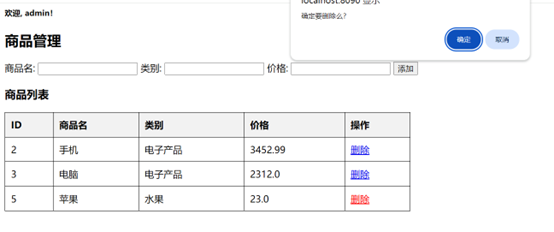  
删除成功后的界面  
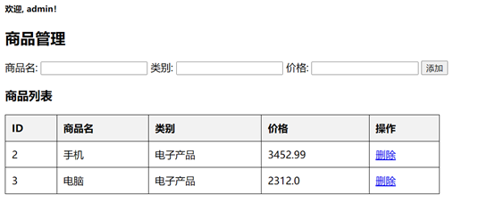
9. 启动项目
    1. 在 MySQL 中执行 SQL 语句，创建数据库和表
    2. 在 Eclipse 中导入项目，确保 Tomcat 服务器已添加
    3. 将 mysql-connector-j.jar 添加到 lib 目录
    4. 启动 Tomcat 服务器，访问 http://localhost:8080/Test02/login.jsp 进行登录
    5. 登录后可进行书籍的添加、修改和删除。注意 Tomcat 的端口号是否是 8080 ，根据环境自行修改
### 实践复习题三 订单管理
本项目是一个基于 Java Web 的订单管理系统，包含订单列表信息、订单信息编辑、订单删除等功能。使用 JSP 、 Servlet 、 JDBC 进行开发，并连接 MySQL 数据库

开发环境：  
IDE ： Eclipse 或 MyEclipse  
JDK ： 8 及以上  
服务器： Apache Tomcat 8 以上  
数据库： MySQL 5.7 及以上  
依赖： JDBC 驱动 （ mysql-connector-java ）

0. PowerShell  
**PS>**
    ```
    mysqld --install
    net stop mysql
    net start mysql
    mysql -u root -p
    ```
    **mysql>** 
    ```
    ALTER USER 'root'@'localhost' IDENTIFIED BY '123456';
    exit;
    ```
    **PS>**
    ```
    net stop mysql
    net start mysql
    mysql -u root -p
1. 数据库表结构。创建 orderdb 数据库，并在数据库中创建 orders ， SQL 语句如下  
**mysql>**
    ```
    CREATE DATABASE orderdb DEFAULT CHARACTER SET utf8mb4 COLLATE utf8mb4_unicode_ci;
    USE orderdb;
    CREATE TABLE orders (
    id INT AUTO_INCREMENT PRIMARY KEY,
    product_name VARCHAR(255) NOT NULL,
    price DECIMAL(10,2) NOT NULL,
    order_time TIMESTAMP DEFAULT CURRENT_TIMESTAMP
    );
    INSERT INTO orders (product_name, price) VALUES
    ('苹果 iPhone 15', 6999.00),
    ('华为 Mate 60', 6299.00),
    ('小米 14', 3999.00),
    ('MacBook Air M2', 8999.00);
    ```
2. 创建项目，项目名为 Test + 学号，学号为两位短学号，如： Test03
3. 在项目中创建一个 com.bean 的包，包下创建 Order （订单）类  
在项目中创建一个 com.servlet 的包，包下创建 EditOrderServlet 、 UpdateOrderServlet 、 DeleteOrderServlet 三个类  
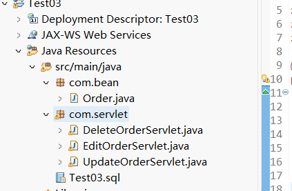  
4. Order 类有三个私有属性 <font color=blue>id</font> 、 <font color=blue>productName</font> 、 <font color=blue>price</font> 、 <font color=blue>orderTime</font>，创建构造初始化方法与 set 、 get 方法
    ```
    package com.bean;
    public class Order {
        private int id;
        private String productName;
        private double price;
        private String orderTime;
        public Order(int id, String productName, double price, String orderTime) {
            this.id = id;
            this.productName = productName;
            this.price = price;
            this.orderTime = orderTime;
        }
        public int getId() { return id; }
        public String getProductName() { return productName; }
        public double getPrice() { return price; }
        public String getOrderTime() { return orderTime; }
        public void setId(int id) {
            this.id = id;
        }
        public void setProductName(String productName) {
            this.productName = productName;
        }
        public void setPrice(double price) {
            this.price = price;
        }
        public void setOrderTime(String orderTime) {
            this.orderTime = orderTime;
        }
    }
    ```
    点击编辑操作的后端处理业务代码
    ```
    package com.servlet;
    import java.io.IOException;
    import java.sql.*;
    import javax.servlet.*;
    import javax.servlet.annotation.WebServlet;
    import javax.servlet.http.*;
    @WebServlet("/EditOrderServlet")
    public class EditOrderServlet extends HttpServlet {
        protected void doGet(HttpServletRequest request, HttpServletResponse response)
                throws ServletException, IOException {
            request.setCharacterEncoding("UTF-8");
            int id = Integer.parseInt(request.getParameter("id"));
            try {
                Class.forName("com.mysql.cj.jdbc.Driver");
                Connection conn = DriverManager.getConnection(
                    "jdbc:mysql://localhost:3306/orderdb", "root", "123456");
                PreparedStatement stmt = conn.prepareStatement(
                    "SELECT * FROM orders WHERE id=?");
                stmt.setInt(1, id);
                ResultSet rs = stmt.executeQuery();
                if (rs.next()) {
                    request.setAttribute("id", rs.getInt("id"));
                    request.setAttribute("productName", rs.getString("product_name"));
                    request.setAttribute("price", rs.getDouble("price"));
                }
                conn.close();
            } catch (Exception e) {
                e.printStackTrace();
            }
            RequestDispatcher dispatcher = request.getRequestDispatcher("/editOrder.jsp");
            dispatcher.forward(request, response);
        }
    }
    ```
    更新订单信息的后端业务代码
    ```
    package com.servlet;
    import java.io.IOException;
    import java.sql.*;
    import javax.servlet.ServletException;
    import javax.servlet.annotation.WebServlet;
    import javax.servlet.http.HttpServlet;
    import javax.servlet.http.HttpServletRequest;
    import javax.servlet.http.HttpServletResponse;
    @WebServlet("/UpdateOrderServlet")
    public class UpdateOrderServlet extends HttpServlet {
        protected void doPost(HttpServletRequest request, HttpServletResponse response) 
                throws ServletException, IOException {
            int id = Integer.parseInt(request.getParameter("id"));
            String productName = request.getParameter("productName");
            double price = Double.parseDouble(request.getParameter("price"));
            try {
                Class.forName("com.mysql.cj.jdbc.Driver");
                Connection conn = DriverManager.getConnection("jdbc:mysql://localhost:3306/orderdb", "root", "123456");
                PreparedStatement stmt = conn.prepareStatement("UPDATE orders SET product_name=?, price=? WHERE id=?");
                stmt.setString(1, productName);
                stmt.setDouble(2, price);
                stmt.setInt(3, id);
                stmt.executeUpdate();
                conn.close();
            } catch (Exception e) {
                e.printStackTrace();
            }
            response.sendRedirect("orderList.jsp");
        }
    }
    ```
    删除的后端实现代码
    ```
    package com.servlet;
    import java.io.IOException;
    import javax.servlet.ServletException;
    import javax.servlet.annotation.WebServlet;
    import javax.servlet.http.HttpServlet;
    import javax.servlet.http.HttpServletRequest;
    import javax.servlet.http.HttpServletResponse;
    import java.sql.*;
    /**
    * Servlet implementation class DeleteOrderServlet
    */
    @WebServlet("/DeleteOrderServlet")
    public class DeleteOrderServlet extends HttpServlet {
        protected void doGet(HttpServletRequest request, HttpServletResponse response) 
                throws ServletException, IOException {
            int id = Integer.parseInt(request.getParameter("id"));
            try {
                Class.forName("com.mysql.cj.jdbc.Driver");
                Connection conn = DriverManager.getConnection("jdbc:mysql://localhost:3306/orderdb", "root", "123456");
                PreparedStatement stmt = conn.prepareStatement("DELETE FROM orders WHERE id=?");
                stmt.setInt(1, id);
                stmt.executeUpdate();
                conn.close();
            } catch (Exception e) {
                e.printStackTrace();
            }
            response.sendRedirect("orderList.jsp");
        }
    }
    ```
5. 将数据库连接驱动复制粘贴到项目中  
  
将 mysql-connector-j.jar 加入 WEB-INF/lib ，然后右击 Build Path ，选择 Add to Build Path 即可
6. 在 webapp 下（软件版本不同，有的在 WebContent ），创建订单列表界面，命名为 orderList.jsp ，如下图所示  
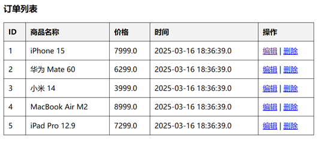  
订单列表页面代码
    ```
    <%@ page language="java" contentType="text/html; charset=UTF-8" pageEncoding="UTF-8"%>
    <%@ page import="java.sql.*" %>
    <html>
    <head>
        <title>订单管理</title>
    </head>
    <style>
            form { margin-bottom: 20px; }
            table { width: 50%; border-collapse: collapse; }
            th, td { border: 1px solid black; padding: 10px; text-align: left; }
            th { background-color: #f2f2f2; }
    </style>
    <body>
        <h3>订单列表</h3>
        <table border="1">
            <tr>
                <th>ID</th><th>商品名称</th><th>价格</th><th>时间</th><th>操作</th>
            </tr>
            <% 
                try {
                    Class.forName("com.mysql.cj.jdbc.Driver");
                    Connection conn = DriverManager.getConnection("jdbc:mysql://localhost:3306/orderdb?useSSL=false&serverTimezone=UTC", "root", "123456");
                    Statement stmt = conn.createStatement();
                    ResultSet rs = stmt.executeQuery("SELECT * FROM orders");
                    while(rs.next()) {
            %>
            <tr>
                <td><%= rs.getInt("id") %></td>
                <td><%= rs.getString("product_name") %></td>
                <td><%= rs.getDouble("price") %></td>
                <td><%= rs.getTimestamp("order_time") %></td>
                <td>
                    <a href="EditOrderServlet?id=<%= rs.getInt("id") %>">编辑</a> |
                    <a href="DeleteOrderServlet?id=<%= rs.getInt("id") %>" onclick="return confirm('确定删除吗？')">删除</a>
                </td>
            </tr>
            <% 
                    }
                    conn.close();
                } catch (Exception e) {
                    e.printStackTrace();
                }
            %>
        </table>
    </body>
    </html>
    ```
7. 点击编辑按钮进入编辑页面，页面如下，创建名称为 editOrder.jsp 。然后修改订单信息，点击更新按钮，成功后回到订单列表信息页面  
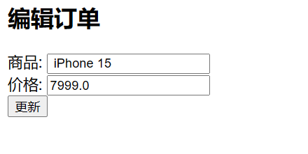  
编辑页面代码
    ```
    <%@ page language="java" contentType="text/html; charset=UTF-8" pageEncoding="UTF-8"%>
    <html>
    <head>
        <title>编辑订单</title>
    </head>
    <body>
        <h2>编辑订单</h2>
        <form action="UpdateOrderServlet" method="post">
            <input type="hidden" name="id" value="<%= request.getAttribute("id") %>">
            商品: <input type="text" name="productName" value="<%= request.getAttribute("productName") %>" required><br>
            价格: <input type="text" name="price" value="<%= request.getAttribute("price") %>" required><br>
            <input type="submit" value="更新">
        </form>
    </body>
    </html>
    ```
8. 点击表格中的删除按钮，弹出确定删除的弹框，点击确定即将该订单信息删除，删除成功后，页面重新刷新，显示新的订单列表信息  
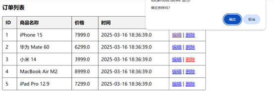  
删除成功后的界面  
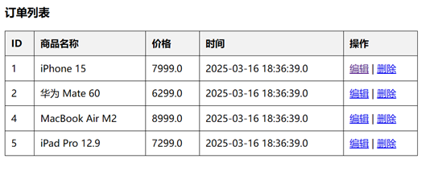
9. 启动项目
    1. 在 MySQL 中执行 SQL 语句，创建数据库和表
    2. 在 Eclipse 中导入项目，确保 Tomcat 服务器已添加
    3. 将 mysql-connector-j.jar 添加到 lib 目录
    4. 启动 Tomcat 服务器，访问 http://localhost:8080/Test03/orderList.jsp 进行登录
    5. 登录后可进行订单的编辑和删除。注意 Tomcat 的端口号是否是 8080 ，根据环境自行修改
### 实践复习题四 用户信息编辑
本项目是一个基于 Java Web 的用户信息编辑系统，包含用户登录、用户注册、密码修改功能。使用 JSP 、 Servlet 、 JDBC 进行开发，并连接 MySQL 数据库

开发环境：
IDE ： Eclipse 或者 MyEclipse
JDK ： 8 及以上
服务器： Apache Tomcat 8 以上
数据库： MySQL 5.7 及以上
依赖： JDBC 驱动（ mysql-connector-j ）

0. PowerShell  
**PS>**
    ```
    mysqld --install
    net stop mysql
    net start mysql
    mysql -u root -p
    ```
    **mysql>**
    ```
    ALTER USER 'root'@'localhost' IDENTIFIED BY '123456';
    exit;
    ```
    **PS>**
    ```
    net stop mysql
    net start mysql
    mysql -u root -p
1. 数据库表结构。创建 userdb 数据库，并在数据库中创建 users 表， SQL 语句如下
**mysql>**
    ```
    CREATE DATABASE userdb;
    USE userdb;
    CREATE TABLE users (
    id INT PRIMARY KEY AUTO_INCREMENT,
    username VARCHAR(50) NOT NULL UNIQUE,
    password VARCHAR(255) NOT NULL,
    phone VARCHAR(20) NOT NULL
    );
    ```
2. 创建项目，项目名为 Test + 学号，学号为两位短学号，如： Test04
3. 在项目中创建一个 com.bean 的包，包下创建 User （用户）类  
在项目中创建一个 com.servlet 的包，包下创建 LoginServlet 、 RegisterServlet 、 ChangePasswordServlet 三个类  
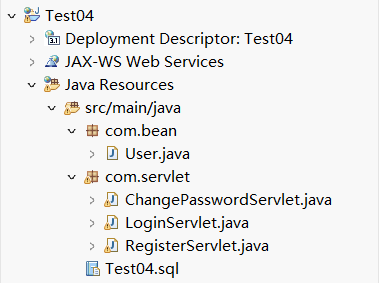
4. User 类有四个私有属性 <font color=blue>id</font> 、 <font color=blue>username</font> 、 <font color=blue>password</font> 、 <font color=blue>phone</font> ，创建构造初始化方法与 set 、 get 方法
    ```
    package com.bean;
    public class User {
        private int id;
        private String username;
        private String password;
        private String phone;
        public User() {}
        public User(int id, String username, String password, String phone) {
            this.id = id;
            this.username = username;
            this.password = password;
            this.phone = phone;
        }
        public int getId() { return id; }
        public String getUsername() { return username; }
        public String getPassword() { return password; }
        public String getPhone() { return phone; }
        public void setId(int id) { this.id = id; }
        public void setUsername(String username) { this.username = username; }
        public void setPassword(String password) { this.password = password; }
        public void setPhone(String phone) { this.phone = phone; }
    }
    ```
    后端接受登录信息代码
    ```
    package com.servlet;
    import java.io.IOException;
    import java.sql.*;
    import javax.servlet.ServletException;
    import javax.servlet.annotation.WebServlet;
    import javax.servlet.http.*;
    @WebServlet("/LoginServlet")
    public class LoginServlet extends HttpServlet {
        protected void doPost(HttpServletRequest request, HttpServletResponse response) 
                throws ServletException, IOException {
            String username = request.getParameter("username");
            String password = request.getParameter("password");
            try {
                Class.forName("com.mysql.cj.jdbc.Driver");
                Connection conn = DriverManager.getConnection("jdbc:mysql://localhost:3306/userdb", "root", "123456");
                PreparedStatement stmt = conn.prepareStatement("SELECT * FROM users WHERE username=? AND password=?");
                stmt.setString(1, username);
                stmt.setString(2, password);
                ResultSet rs = stmt.executeQuery();
                if (rs.next()) {
                    HttpSession session = request.getSession();
                    session.setAttribute("username", username);
                    response.sendRedirect("welcome.jsp");
                } else {
                    response.getWriter().println("用户名或密码错误！");
                }
                rs.close();
                stmt.close();
                conn.close();
            } catch (Exception e) {
                e.printStackTrace();
            }
        }
    }
    ```
    后端注册处理业务代码
    ```
    package com.servlet;
    import java.io.IOException;
    import java.sql.*;
    import javax.servlet.ServletException;
    import javax.servlet.annotation.WebServlet;
    import javax.servlet.http.*;
    import com.bean.User;
    @WebServlet("/RegisterServlet")
    public class RegisterServlet extends HttpServlet {
        protected void doPost(HttpServletRequest request, HttpServletResponse response) 
                throws ServletException, IOException {
            String username = request.getParameter("username");
            String password = request.getParameter("password");
            String confirmPassword = request.getParameter("confirmPassword");
            String phone = request.getParameter("phone");
            if (!password.equals(confirmPassword)) {
                response.getWriter().println("两次输入的密码不一致！");
                return;
            }
            User u=new User();
            u.setUsername(username);
            u.setPassword(password);
            u.setPhone(phone);
            try {
                Class.forName("com.mysql.cj.jdbc.Driver");
                Connection conn = DriverManager.getConnection("jdbc:mysql://localhost:3306/userdb", "root", "123456");
                PreparedStatement stmt = conn.prepareStatement("INSERT INTO users (username, password, phone) VALUES (?, ?, ?)");
                stmt.setString(1, u.getUsername());
                stmt.setString(2, u.getPassword());
                stmt.setString(3, u.getPhone());
                if (stmt.executeUpdate() > 0) {
                    response.sendRedirect("login.jsp");
                } else {
                    response.getWriter().println("注册失败！");
                }
                stmt.close();
                conn.close();
            } catch (Exception e) {
                e.printStackTrace();
            }
        }
    }
    ```
    后端实现代码
    ```
    package com.servlet;
    import java.io.IOException;
    import java.sql.*;
    import javax.servlet.ServletException;
    import javax.servlet.annotation.WebServlet;
    import javax.servlet.http.*;
    @WebServlet("/ChangePasswordServlet")
    public class ChangePasswordServlet extends HttpServlet {
        protected void doPost(HttpServletRequest request, HttpServletResponse response) 
                throws ServletException, IOException {
            String username = request.getParameter("username");
            String newPassword = request.getParameter("newPassword");
            try {
                Class.forName("com.mysql.cj.jdbc.Driver");
                Connection conn = DriverManager.getConnection("jdbc:mysql://localhost:3306/userdb", "root", "123456");
                PreparedStatement stmt = conn.prepareStatement("UPDATE users SET password=? WHERE username=?");
                stmt.setString(1, newPassword);
                stmt.setString(2, username);
                if (stmt.executeUpdate() > 0) {
                    response.sendRedirect("login.jsp");
                } else {
                    response.getWriter().println("密码修改失败！");
                }
                stmt.close();
                conn.close();
            } catch (Exception e) {
                e.printStackTrace();
            }
        }
    }
    ```
5. 将数据库连接驱动复制粘贴到项目中  
  
将 mysql-connector-j 加入 WEB-INF/lib ，然后右击 Build Path ，选择 Add to Build Path 即可
6. 在 webapp 下（软件版本不同，有的在 WebContent ），创建登录界面，命名为 login.jsp ，如下图所示，实现用户登录功能，在首次登录时需要点击注册进行用户信息注册，注册界面为 register.jsp  
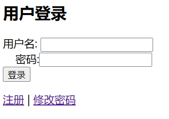  
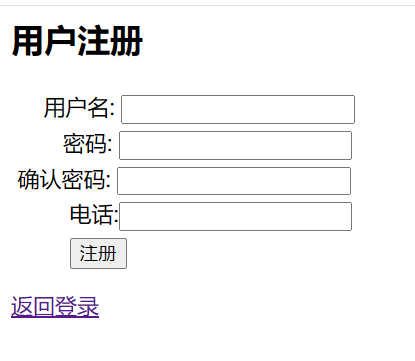  
登录页面代码
    ```
    <%@ page contentType="text/html; charset=UTF-8" %>
    <html>
    <head>
        <title>用户登录</title>
    </head>
    <body>
        <h2>用户登录</h2>
        <form action="LoginServlet" method="post">
            用户名: <input type="text" name="username" required><br>
        &nbsp;&nbsp;&nbsp;&nbsp;密码:<input type="password" name="password" required><br>
            <input type="submit" value="登录">
        </form>
        <a href="register.jsp">注册</a> | <a href="passwordChange.jsp">修改密码</a>
    </body>
    </html>
    ```
    注册页面代码
    ```
    <%@ page contentType="text/html; charset=UTF-8" %>
    <html>
    <head>
        <title>用户注册</title>
    </head>
    <style>
        input{
        margin-top:5px
        }
    </style>
    <body>
        <h2>用户注册</h2>
        <form action="RegisterServlet" method="post">
            用户名: <input type="text" name="username" required><br>
            密码: <input type="password" name="password" required><br>
            确认密码: <input type="password" name="confirmPassword" required><br>
            电话:<input type="text" name="phone" required><br>
        <input type="submit" value="注册">
        </form>
        <a href="login.jsp">返回登录</a>
    </body>
    </html>
    ```
7. 登录成功后跳转到欢迎页面，页面为 welcome.jsp ，通过会话 Session 获取用户的用户名信息，界面如下图所示。点击退出又重新回到登录页面  
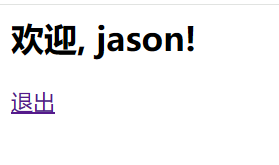  
欢迎页面
    ```
    <%@ page contentType="text/html; charset=UTF-8" %>
    <%@ page import="javax.servlet.http.HttpSession" %>
    <html>
    <head>
        <title>欢迎</title>
    </head>
    <body>
        <h2>欢迎, <%= session.getAttribute("username") %>!</h2>
        <a href="login.jsp">退出</a>
    </body>
    </html>
    ```
8. 如果用户要修改密码，点击登录界面中的忘记密码进入密码修改界面， passwordChange.jsp  
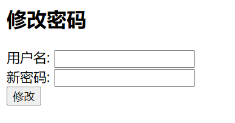  
密码修改界面代码
    ```
    <%@ page contentType="text/html; charset=UTF-8" %>
    <html>
    <head>
        <title>修改密码</title>
    </head>
    <body>
        <h2>修改密码</h2>
        <form action="ChangePasswordServlet" method="post">
            用户名: <input type="text" name="username" required><br>
            新密码: <input type="password" name="newPassword" required><br>
            <input type="submit" value="修改">
        </form>
    </body>
    </html>
    ```
9. 启动项目
    1. 在 MySQL 中执行 SQL 语句，创建数据库和表
    2. 在 Eclipse 中导入项目，确保 Tomcat 服务器已添加
    3. 将 mysql-connector-j.jar 添加到 lib 目录
    4. 启动 Tomcat 服务器，访问 http://localhost:8080/Test04/login.jsp 进行登录
    5. 登录后可进行书籍的添加、修改和删除。注意 Tomcat 的端口号是否是 8080 ，根据环境自行修改