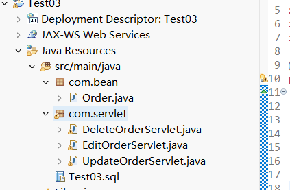
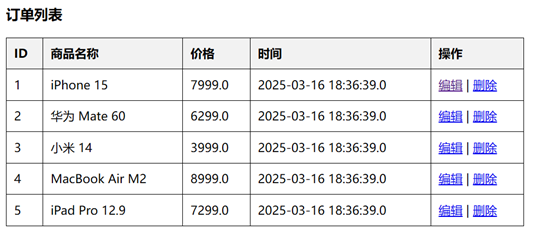
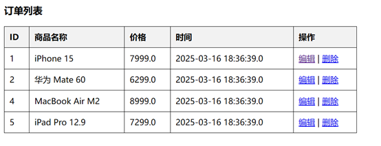

### 实践复习题三 订单管理
本项目是一个基于 Java Web 的订单管理系统，包含订单列表信息、订单信息编辑、订单删除等功能。使用 JSP 、 Servlet 、 JDBC 进行开发，并连接 MySQL 数据库

开发环境：  
IDE ： Eclipse 或 MyEclipse  
JDK ： 8 及以上  
服务器： Apache Tomcat 8 以上  
数据库： MySQL 5.7 及以上  
依赖： JDBC 驱动 （ mysql-connector-java ）

0. PowerShell  
**PS>**
    ```
    mysqld --install
    net stop mysql
    net start mysql
    mysql -u root -p
    ```
    **mysql>** 
    ```
    ALTER USER 'root'@'localhost' IDENTIFIED BY '123456';
    exit
    ```
    **PS>**
    ```
    net stop mysql
    net start mysql
    mysql -u root -p
1. 数据库表结构。创建 orderdb 数据库，并在数据库中创建 orders ， SQL 语句如下  
**mysqld>**
    ```
    CREATE DATABASE orderdb DEFAULT CHARACTER SET utf8mb4 COLLATE utf8mb4_unicode_ci;
    USE orderdb;
    CREATE TABLE orders (
    id INT AUTO_INCREMENT PRIMARY KEY,
    product_name VARCHAR(255) NOT NULL,
    price DECIMAL(10,2) NOT NULL,
    order_time TIMESTAMP DEFAULT CURRENT_TIMESTAMP
    );
    INSERT INTO orders (product_name, price) VALUES
    ('苹果 iPhone 15', 6999.00),
    ('华为 Mate 60', 6299.00),
    ('小米 14', 3999.00),
    ('MacBook Air M2', 8999.00);
    ```
2. 创建项目，项目名为 Test + 学号，学号为两位短学号，如： Test03
3. 在项目中创建一个 com.bean 的包，包下创建 Order （订单）类  
在项目中创建一个 com.servlet 的包，包下创建 EditOrderServlet 、 UpdateOrderServlet 、 DeleteOrderServlet 三个类  
  
4. Order 类有三个私有属性 <font color=blue>id</font> 、 <font color=blue>productName</font> 、 <font color=blue>price</font> 、 <font color=blue>orderTime</font>，创建构造初始化方法与 set 、 get 方法
    ```
    package com.bean;
    public class Order {
        private int id;
        private String productName;
        private double price;
        private String orderTime;
        public Order(int id, String productName, double price, String orderTime) {
            this.id = id;
            this.productName = productName;
            this.price = price;
            this.orderTime = orderTime;
        }
        public int getId() { return id; }
        public String getProductName() { return productName; }
        public double getPrice() { return price; }
        public String getOrderTime() { return orderTime; }
        public void setId(int id) {
            this.id = id;
        }
        public void setProductName(String productName) {
            this.productName = productName;
        }
        public void setPrice(double price) {
            this.price = price;
        }
        public void setOrderTime(String orderTime) {
            this.orderTime = orderTime;
        }
    }
    ```
    点击编辑操作的后端处理业务代码
    ```
    package com.servlet;
    import java.io.IOException;
    import java.sql.*;
    import javax.servlet.*;
    import javax.servlet.annotation.WebServlet;
    import javax.servlet.http.*;
    @WebServlet("/EditOrderServlet")
    public class EditOrderServlet extends HttpServlet {
        protected void doGet(HttpServletRequest request, HttpServletResponse response)
                throws ServletException, IOException {
            request.setCharacterEncoding("UTF-8");
            int id = Integer.parseInt(request.getParameter("id"));
            try {
                Class.forName("com.mysql.cj.jdbc.Driver");
                Connection conn = DriverManager.getConnection(
                    "jdbc:mysql://localhost:3306/orderdb", "root", "123456");
                PreparedStatement stmt = conn.prepareStatement(
                    "SELECT * FROM orders WHERE id=?");
                stmt.setInt(1, id);
                ResultSet rs = stmt.executeQuery();
                if (rs.next()) {
                    request.setAttribute("id", rs.getInt("id"));
                    request.setAttribute("productName", rs.getString("product_name"));
                    request.setAttribute("price", rs.getDouble("price"));
                }
                conn.close();
            } catch (Exception e) {
                e.printStackTrace();
            }
            RequestDispatcher dispatcher = request.getRequestDispatcher("/editOrder.jsp");
            dispatcher.forward(request, response);
        }
    }
    ```
    更新订单信息的后端业务代码
    ```
    package com.servlet;
    import java.io.IOException;
    import java.sql.*;
    import javax.servlet.ServletException;
    import javax.servlet.annotation.WebServlet;
    import javax.servlet.http.HttpServlet;
    import javax.servlet.http.HttpServletRequest;
    import javax.servlet.http.HttpServletResponse;
    @WebServlet("/UpdateOrderServlet")
    public class UpdateOrderServlet extends HttpServlet {
        protected void doPost(HttpServletRequest request, HttpServletResponse response) 
                throws ServletException, IOException {
            int id = Integer.parseInt(request.getParameter("id"));
            String productName = request.getParameter("productName");
            double price = Double.parseDouble(request.getParameter("price"));
            try {
                Class.forName("com.mysql.cj.jdbc.Driver");
                Connection conn = DriverManager.getConnection("jdbc:mysql://localhost:3306/orderdb", "root", "123456");
                PreparedStatement stmt = conn.prepareStatement("UPDATE orders SET product_name=?, price=? WHERE id=?");
                stmt.setString(1, productName);
                stmt.setDouble(2, price);
                stmt.setInt(3, id);
                stmt.executeUpdate();
                conn.close();
            } catch (Exception e) {
                e.printStackTrace();
            }
            response.sendRedirect("orderList.jsp");
        }
    }
    ```
    删除的后端实现代码
    ```
    package com.servlet;
    import java.io.IOException;
    import javax.servlet.ServletException;
    import javax.servlet.annotation.WebServlet;
    import javax.servlet.http.HttpServlet;
    import javax.servlet.http.HttpServletRequest;
    import javax.servlet.http.HttpServletResponse;
    import java.sql.*;
    /**
    * Servlet implementation class DeleteOrderServlet
    */
    @WebServlet("/DeleteOrderServlet")
    public class DeleteOrderServlet extends HttpServlet {
        protected void doGet(HttpServletRequest request, HttpServletResponse response) 
                throws ServletException, IOException {
            int id = Integer.parseInt(request.getParameter("id"));
            try {
                Class.forName("com.mysql.cj.jdbc.Driver");
                Connection conn = DriverManager.getConnection("jdbc:mysql://localhost:3306/orderdb", "root", "123456");
                PreparedStatement stmt = conn.prepareStatement("DELETE FROM orders WHERE id=?");
                stmt.setInt(1, id);
                stmt.executeUpdate();
                conn.close();
            } catch (Exception e) {
                e.printStackTrace();
            }
            response.sendRedirect("orderList.jsp");
        }
    }
    ```
5. 将数据库连接驱动复制粘贴到项目中  
  
将 mysql-connector-j.jar 加入 WEB-INF/lib ，然后右击 Build Path ，选择 Add to Build Path 即可
6. 在 webapp 下（软件版本不同，有的在 WebContent ），创建订单列表界面，命名为 orderList.jsp ，如下图所示  
  
订单列表页面代码
    ```
    <%@ page language="java" contentType="text/html; charset=UTF-8" pageEncoding="UTF-8"%>
    <%@ page import="java.sql.*" %>
    <html>
    <head>
        <title>订单管理</title>
    </head>
    <style>
            form { margin-bottom: 20px; }
            table { width: 50%; border-collapse: collapse; }
            th, td { border: 1px solid black; padding: 10px; text-align: left; }
            th { background-color: #f2f2f2; }
    </style>
    <body>
        <h3>订单列表</h3>
        <table border="1">
            <tr>
                <th>ID</th><th>商品名称</th><th>价格</th><th>时间</th><th>操作</th>
            </tr>
            <% 
                try {
                    Class.forName("com.mysql.cj.jdbc.Driver");
                    Connection conn = DriverManager.getConnection("jdbc:mysql://localhost:3306/orderdb?useSSL=false&serverTimezone=UTC", "root", "123456");
                    Statement stmt = conn.createStatement();
                    ResultSet rs = stmt.executeQuery("SELECT * FROM orders");
                    while(rs.next()) {
            %>
            <tr>
                <td><%= rs.getInt("id") %></td>
                <td><%= rs.getString("product_name") %></td>
                <td><%= rs.getDouble("price") %></td>
                <td><%= rs.getTimestamp("order_time") %></td>
                <td>
                    <a href="EditOrderServlet?id=<%= rs.getInt("id") %>">编辑</a> |
                    <a href="DeleteOrderServlet?id=<%= rs.getInt("id") %>" onclick="return confirm('确定删除吗？')">删除</a>
                </td>
            </tr>
            <% 
                    }
                    conn.close();
                } catch (Exception e) {
                    e.printStackTrace();
                }
            %>
        </table>
    </body>
    </html>
    ```
7. 点击编辑按钮进入编辑页面，页面如下，创建名称为 editOrder.jsp 。然后修改订单信息，点击更新按钮，成功后回到订单列表信息页面  
  
编辑页面代码
    ```
    <%@ page language="java" contentType="text/html; charset=UTF-8" pageEncoding="UTF-8"%>
    <html>
    <head>
        <title>编辑订单</title>
    </head>
    <body>
        <h2>编辑订单</h2>
        <form action="UpdateOrderServlet" method="post">
            <input type="hidden" name="id" value="<%= request.getAttribute("id") %>">
            商品: <input type="text" name="productName" value="<%= request.getAttribute("productName") %>" required><br>
            价格: <input type="text" name="price" value="<%= request.getAttribute("price") %>" required><br>
            <input type="submit" value="更新">
        </form>
    </body>
    </html>
    ```
8. 点击表格中的删除按钮，弹出确定删除的弹框，点击确定即将该订单信息删除，删除成功后，页面重新刷新，显示新的订单列表信息  
  
删除成功后的界面  

9. 启动项目
    1. 在 MySQL 中执行 SQL 语句，创建数据库和表
    2. 在 Eclipse 中导入项目，确保 Tomcat 服务器已添加
    3. 将 mysql-connector-j.jar 添加到 lib 目录
    4. 启动 Tomcat 服务器，访问 http://localhost:8080/Test03/orderList.jsp 进行登录
    5. 登录后可进行订单的编辑和删除。注意 Tomcat 的端口号是否是 8080 ，根据环境自行修改