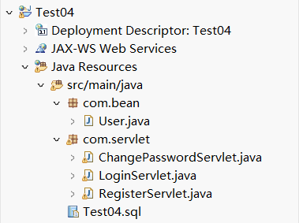
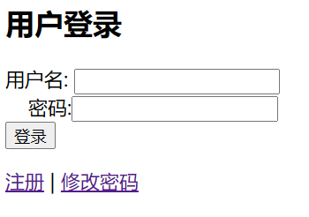
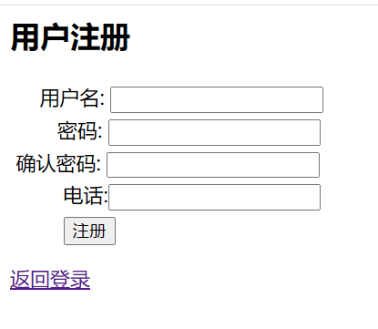
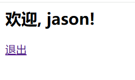
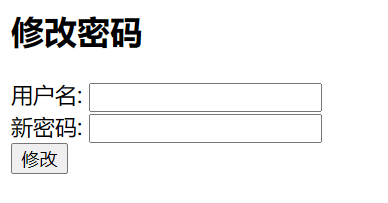

### 实践复习题四 用户信息编辑
本项目是一个基于 Java Web 的用户信息编辑系统，包含用户登录、用户注册、密码修改功能。使用 JSP 、 Servlet 、 JDBC 进行开发，并连接 MySQL 数据库

开发环境：
IDE ： Eclipse 或者 MyEclipse
JDK ： 8 及以上
服务器： Apache Tomcat 8 以上
数据库： MySQL 5.7 及以上
依赖： JDBC 驱动（ mysql-connector-j ）

0. PowerShell  
    **PS>**
    ```
    mysqld --install
    net stop mysql
    net start mysql
    mysql -u root -p
    ```
    **mysql>** 
    ```
    ALTER USER 'root'@'localhost' IDENTIFIED BY '123456';
    exit
    ```
    **PS>**
    ```
    net stop mysql
    net start mysql
    mysql -u root -p
1. 数据库表结构。创建 userdb 数据库，并在数据库中创建 users 表， SQL 语句如下
    ```
    CREATE DATABASE userdb;
    USE userdb;
    CREATE TABLE users (
    id INT PRIMARY KEY AUTO_INCREMENT,
    username VARCHAR(50) NOT NULL UNIQUE,
    password VARCHAR(255) NOT NULL,
    phone VARCHAR(20) NOT NULL
    );
    ```
2. 创建项目，项目名为 Test + 学号，学号为两位短学号，如： Test04
3. 在项目中创建一个 com.bean 的包，包下创建 User （用户）类  
在项目中创建一个 com.servlet 的包，包下创建 LoginServlet 、 RegisterServlet 、 ChangePasswordServlet 三个类  

4. User 类有四个私有属性 <font color=blue>id</font> 、 <font color=blue>username</font> 、 <font color=blue>password</font> 、 <font color=blue>phone</font> ，创建构造初始化方法与 set 、 get 方法
    ```
    package com.bean;
    public class User {
        private int id;
        private String username;
        private String password;
        private String phone;
        public User() {}
        public User(int id, String username, String password, String phone) {
            this.id = id;
            this.username = username;
            this.password = password;
            this.phone = phone;
        }
        public int getId() { return id; }
        public String getUsername() { return username; }
        public String getPassword() { return password; }
        public String getPhone() { return phone; }
        public void setId(int id) { this.id = id; }
        public void setUsername(String username) { this.username = username; }
        public void setPassword(String password) { this.password = password; }
        public void setPhone(String phone) { this.phone = phone; }
    }
    ```
    后端接受登录信息代码
    ```
    package com.servlet;
    import java.io.IOException;
    import java.sql.*;
    import javax.servlet.ServletException;
    import javax.servlet.annotation.WebServlet;
    import javax.servlet.http.*;
    @WebServlet("/LoginServlet")
    public class LoginServlet extends HttpServlet {
        protected void doPost(HttpServletRequest request, HttpServletResponse response) 
                throws ServletException, IOException {
            String username = request.getParameter("username");
            String password = request.getParameter("password");
            try {
                Class.forName("com.mysql.cj.jdbc.Driver");
                Connection conn = DriverManager.getConnection("jdbc:mysql://localhost:3306/userdb", "root", "123456");
                PreparedStatement stmt = conn.prepareStatement("SELECT * FROM users WHERE username=? AND password=?");
                stmt.setString(1, username);
                stmt.setString(2, password);
                ResultSet rs = stmt.executeQuery();
                if (rs.next()) {
                    HttpSession session = request.getSession();
                    session.setAttribute("username", username);
                    response.sendRedirect("welcome.jsp");
                } else {
                    response.getWriter().println("用户名或密码错误！");
                }
                rs.close();
                stmt.close();
                conn.close();
            } catch (Exception e) {
                e.printStackTrace();
            }
        }
    }
    ```
    后端注册处理业务代码
    ```
    package com.servlet;
    import java.io.IOException;
    import java.sql.*;
    import javax.servlet.ServletException;
    import javax.servlet.annotation.WebServlet;
    import javax.servlet.http.*;
    import com.bean.User;
    @WebServlet("/RegisterServlet")
    public class RegisterServlet extends HttpServlet {
        protected void doPost(HttpServletRequest request, HttpServletResponse response) 
                throws ServletException, IOException {
            String username = request.getParameter("username");
            String password = request.getParameter("password");
            String confirmPassword = request.getParameter("confirmPassword");
            String phone = request.getParameter("phone");
            if (!password.equals(confirmPassword)) {
                response.getWriter().println("两次输入的密码不一致！");
                return;
            }
            User u=new User();
            u.setUsername(username);
            u.setPassword(password);
            u.setPhone(phone);
            try {
                Class.forName("com.mysql.cj.jdbc.Driver");
                Connection conn = DriverManager.getConnection("jdbc:mysql://localhost:3306/userdb", "root", "123456");
                PreparedStatement stmt = conn.prepareStatement("INSERT INTO users (username, password, phone) VALUES (?, ?, ?)");
                stmt.setString(1, u.getUsername());
                stmt.setString(2, u.getPassword());
                stmt.setString(3, u.getPhone());
                if (stmt.executeUpdate() > 0) {
                    response.sendRedirect("login.jsp");
                } else {
                    response.getWriter().println("注册失败！");
                }
                stmt.close();
                conn.close();
            } catch (Exception e) {
                e.printStackTrace();
            }
        }
    }
    ```
    后端实现代码
    ```
    package com.servlet;
    import java.io.IOException;
    import java.sql.*;
    import javax.servlet.ServletException;
    import javax.servlet.annotation.WebServlet;
    import javax.servlet.http.*;
    @WebServlet("/ChangePasswordServlet")
    public class ChangePasswordServlet extends HttpServlet {
        protected void doPost(HttpServletRequest request, HttpServletResponse response) 
                throws ServletException, IOException {
            String username = request.getParameter("username");
            String newPassword = request.getParameter("newPassword");
            try {
                Class.forName("com.mysql.cj.jdbc.Driver");
                Connection conn = DriverManager.getConnection("jdbc:mysql://localhost:3306/userdb", "root", "123456");
                PreparedStatement stmt = conn.prepareStatement("UPDATE users SET password=? WHERE username=?");
                stmt.setString(1, newPassword);
                stmt.setString(2, username);
                if (stmt.executeUpdate() > 0) {
                    response.sendRedirect("login.jsp");
                } else {
                    response.getWriter().println("密码修改失败！");
                }
                stmt.close();
                conn.close();
            } catch (Exception e) {
                e.printStackTrace();
            }
        }
    }
    ```
5. 将数据库连接驱动复制粘贴到项目中  
  
将 mysql-connector-j 加入 WEB-INF/lib ，然后右击 Build Path ，选择 Add to Build Path 即可
6. 在 webapp 下（软件版本不同，有的在 WebContent ），创建登录界面，命名为 login.jsp ，如下图所示，实现用户登录功能，在首次登录时需要点击注册进行用户信息注册，注册界面为 register.jsp  
  
  
登录页面代码
    ```
    <%@ page contentType="text/html; charset=UTF-8" %>
    <html>
    <head>
        <title>用户登录</title>
    </head>
    <body>
        <h2>用户登录</h2>
        <form action="LoginServlet" method="post">
            用户名: <input type="text" name="username" required><br>
        &nbsp;&nbsp;&nbsp;&nbsp;密码:<input type="password" name="password" required><br>
            <input type="submit" value="登录">
        </form>
        <a href="register.jsp">注册</a> | <a href="passwordChange.jsp">修改密码</a>
    </body>
    </html>
    ```
    注册页面代码
    ```
    <%@ page contentType="text/html; charset=UTF-8" %>
    <html>
    <head>
        <title>用户注册</title>
    </head>
    <style>
        input{
        margin-top:5px
        }
    </style>
    <body>
        <h2>用户注册</h2>
        <form action="RegisterServlet" method="post">
            用户名: <input type="text" name="username" required><br>
            密码: <input type="password" name="password" required><br>
            确认密码: <input type="password" name="confirmPassword" required><br>
            电话:<input type="text" name="phone" required><br>
        <input type="submit" value="注册">
        </form>
        <a href="login.jsp">返回登录</a>
    </body>
    </html>
    ```
7. 登录成功后跳转到欢迎页面，页面为 welcome.jsp ，通过会话 Session 获取用户的用户名信息，界面如下图所示。点击退出又重新回到登录页面  
  
欢迎页面
    ```
    <%@ page contentType="text/html; charset=UTF-8" %>
    <%@ page import="javax.servlet.http.HttpSession" %>
    <html>
    <head>
        <title>欢迎</title>
    </head>
    <body>
        <h2>欢迎, <%= session.getAttribute("username") %>!</h2>
        <a href="login.jsp">退出</a>
    </body>
    </html>
    ```
8. 如果用户要修改密码，点击登录界面中的忘记密码进入密码修改界面， passwordChange.jsp  
  
密码修改界面代码
    ```
    <%@ page contentType="text/html; charset=UTF-8" %>
    <html>
    <head>
        <title>修改密码</title>
    </head>
    <body>
        <h2>修改密码</h2>
        <form action="ChangePasswordServlet" method="post">
            用户名: <input type="text" name="username" required><br>
            新密码: <input type="password" name="newPassword" required><br>
            <input type="submit" value="修改">
        </form>
    </body>
    </html>
    ```
9. 启动项目
    1. 在 MySQL 中执行 SQL 语句，创建数据库和表
    2. 在 Eclipse 中导入项目，确保 Tomcat 服务器已添加
    3. 将 mysql-connector-j.jar 添加到 lib 目录
    4. 启动 Tomcat 服务器，访问 http://localhost:8080/Test04/login.jsp 进行登录
    5. 登录后可进行书籍的添加、修改和删除。注意 Tomcat 的端口号是否是 8080 ，根据环境自行修改